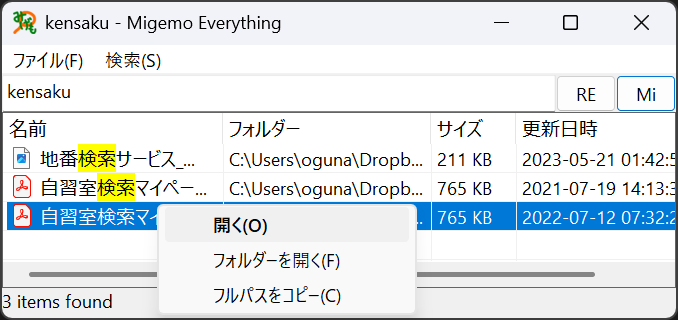

# migemo-everything



## ビルド方法

```shell
cargo build --release
```

## 実行方法
実行ファイルと同じフォルダに、`Everything64.dll`と`migemo-compact-dict`があることを確認してください。
また、Everythingが実行中であることも確認してください。

`migemo-everything.exe`を起動すると、画面が表示されます。

## ライセンス
私が作成したプログラムは **MIT License** に従います。詳細は`LICENSE`をご確認ください。

ただし、以下のファイルには別のライセンスが適用されます。
- `Everything64.dll`: https://www.voidtools.com/License.txt
- `migemo-compact-dict`: https://github.com/oguna/yet-another-migemo-dict